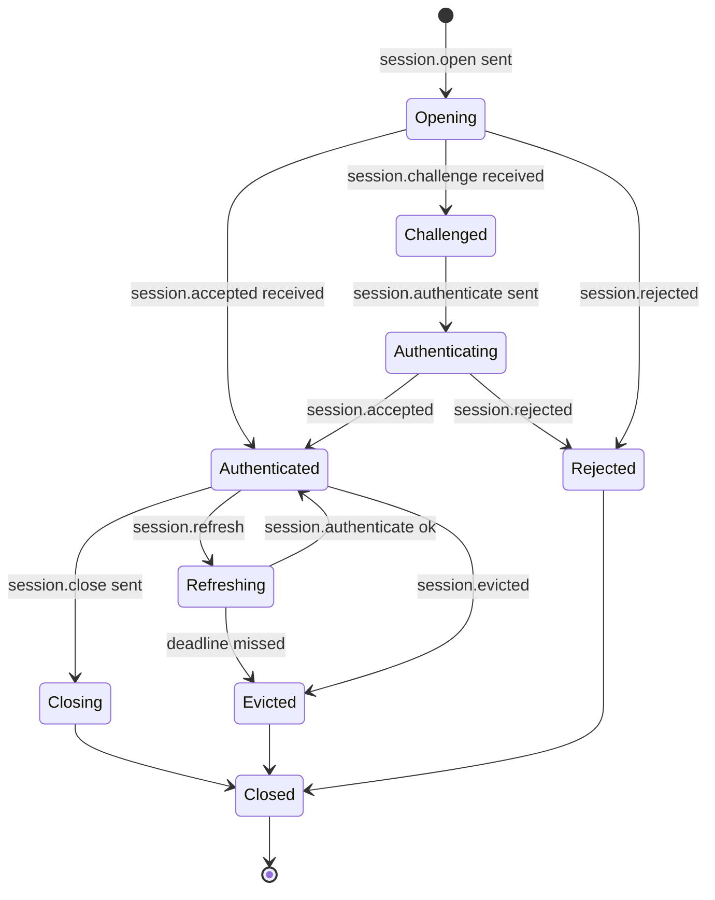
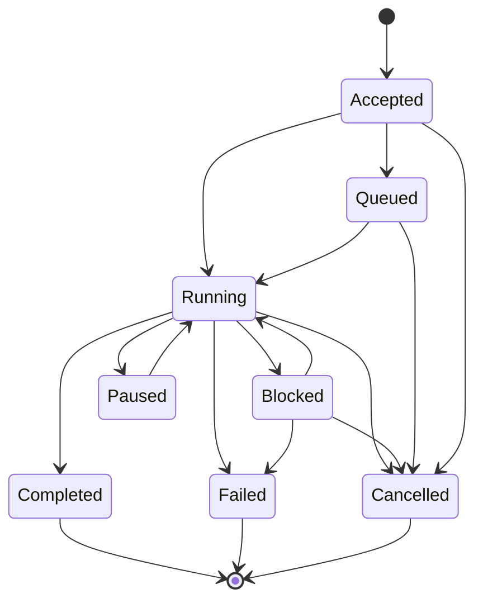
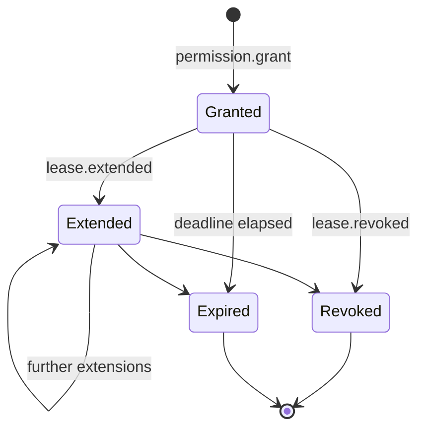
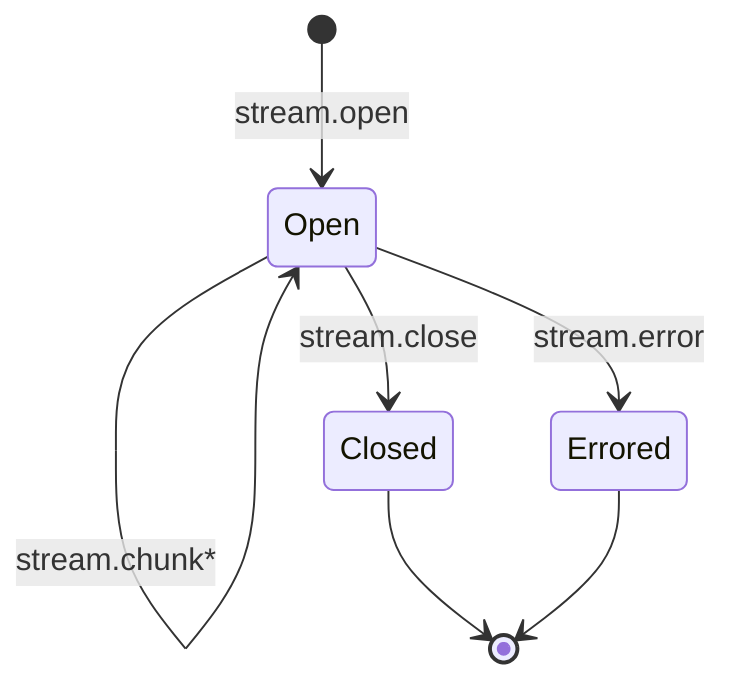

# PLAN — ARCP PHP SDK v0.1

This document is the **Phase 0** deliverable for `arcp/arcp` (the PHP reference
SDK for the Agent Runtime Control Protocol). It is the authoritative
implementation plan: per-section RFC summary, message-type-to-class mapping,
state-machine sketches, open questions with chosen interpretations, full test
plan, PHP-specific design notes, and an explicit list of items deferred to v0.2.

**Source of truth:** [RFC-0001-v2.md](RFC-0001-v2.md), local copy of
`RFC 0001 v2 — Agent Runtime Control Protocol`. When this plan and the RFC
disagree, the RFC wins; this plan flags such conflicts in §"Open questions and
chosen interpretations".

---

## 1. Per-section RFC summary

A condensed restatement of every section, written so the implementer of any
given module can find the exact contract they need without re-reading the
whole RFC.

### §3–§4: Roles and design principles

Three principal client roles: **active clients** (issue commands), **observers**
(subscribe only), and **peer runtimes** (federate via delegate/handoff). Design
principles that bind us at the implementation level:

- **Transport-agnostic** — the protocol semantics do not change with the
  transport. Implication: `Transport` is a small interface, and every behavior
  test runs against `MemoryTransport`, `WebSocketTransport`, and
  `StdioTransport` via PHPUnit data providers.
- **Streaming native** — `stream.chunk` is a hot path. Implication: the
  stream layer uses `amphp/pipeline` with bounded queues; backpressure is
  cooperative, not best-effort.
- **Durable execution** — heartbeats, cancellation, resume are all required
  surfaces, not nice-to-haves. Implication: tests for these are
  fail-the-build, not skip-when-missing.
- **Authenticated by default** — no traffic before `session.accepted`.
  Implication: `Runtime` has a state machine that drops messages received in
  the wrong state and logs them at WARN.
- **Extensible** — namespaced extensions, namespaced error codes, namespaced
  metric names. Implication: the registry layer (`MessageTypeRegistry`,
  `ExtensionRegistry`) is the only place new types can enter the system.

### §6.1: Envelope

Required fields: `arcp`, `id`, `type`, `timestamp`, `payload`.
Conditional fields: `session_id`, `job_id`, `stream_id`, `subscription_id`.
Recommended: `trace_id`, `span_id`.
Optional: `source`, `target`, `parent_span_id`, `correlation_id`,
`causation_id`, `idempotency_key`, `priority` (default `normal`),
`extensions` (object).

`id` is the **transport** idempotency key. `idempotency_key` is the
**logical** intent key — it survives full reconnects. We persist
`(session_principal, idempotency_key)` for at least the lease horizon and
return the prior outcome on replay (RFC §6.4).

### §6.2: Message type catalog

Mapped to PHP classes in §3 below. Every type lives under
`src/Messages/<group>/`. Extension types land in the registry but have no
core class.

### §6.3: Command/result/event flow

Acks and terminal events both carry `correlation_id` referencing the original
command's `id`. Terminal events for jobs are exactly one of `tool.result` /
`tool.error` / `job.completed` / `job.failed` / `job.cancelled` /
`workflow.complete`.

### §6.4: Delivery semantics

At-least-once. Receivers must dedupe by `id`. Ordering guaranteed only inside
`stream_id` / `job_id`. We honor this exactly: the event log is the dedupe
authority, jobs and streams maintain per-key sequence counters, and tests
assert ordering within a key while explicitly accepting reorder across keys.

### §6.5: Priority and QoS

`low | normal | high | critical`, default `normal`. Higher priority is
scheduled first across streams/jobs (never within). `critical` bypasses
shedding but may be rate-limited per session. Implementation: priority is
honored as a tie-breaker on the runtime's outbound queue and never reorders
intra-stream messages.

### §7: Capability negotiation

Capabilities are negotiated during handshake. Absent boolean = `false`.
Required-but-unsupported features must yield `session.rejected` with
`code: UNIMPLEMENTED`.

Capabilities we advertise from the runtime side in v0.1:
`streaming: true`, `durable_jobs: true`, `checkpoints: false` (resume by
message id only), `binary_streams: true` (base64 only),
`agent_handoff: false`, `human_input: true`, `artifacts: true` (inline
base64 only), `subscriptions: true`, `scheduled_jobs: false`,
`heartbeat_interval_seconds: 30`, `heartbeat_recovery: "fail"`,
`binary_encoding: ["base64"]`,
`artifact_retention: { default_seconds: 86400, max_seconds: 604800 }`,
`extensions: []`.

### §8: Authentication & identity

Four-message handshake. Schemes implemented in v0.1: `bearer`, `signed_jwt`,
`none`. `mtls` and `oauth2` raise `UnimplementedException` with `// TODO(v0.2)`.

Re-authentication via `session.refresh` is a runtime-side capability;
implemented but exercised mostly through tests.

Eviction (`session.evicted`) emits a canonical reason code and lets in-flight
durable jobs be resumed under a new session by id.

### §9: Sessions

Stateless and stateful sessions in v0.1. **Durable** sessions (transport
reconnects with the same `session_id`) are deferred to v0.2 — `resume`
support in v0.1 is limited to the single in-flight transport with
`after_message_id` only.

### §10: Jobs

State machine (§10.2) implemented as an enum + transition table validated by
unit test. `job.heartbeat` watchdog is a per-job fiber on a deterministic
clock. Cancellation is cooperative with deadline + escalation. Interrupts
issue `human.input.request` and transition to `blocked`. Scheduled jobs
(§10.6) are out of scope for v0.1 — `nack` with `UNIMPLEMENTED`.

### §11: Streaming

Six kinds: `text`, `binary`, `event`, `log`, `metric`, `thought`. We
implement `text`, `event`, `log`, `thought`. `binary` uses base64 only.
`metric` events flow through the metric channel directly rather than as a
stream-kind in v0.1 (the RFC permits either; we pick the explicit-event
form for the standard names in §17.3.1).

Backpressure: pipeline-level bounded queue + `backpressure` envelope.
Senders must shed lower-priority traffic first.

### §12: Human-in-the-Loop

`human.input.request` and `human.choice.request` round-trip. Multi-channel
fan-out resolves on first valid response (RFC §12.3 default). Quorum
policies are out of scope for v0.1. `expires_at` honored: if `default` is
present we synthesize the response; otherwise we emit
`human.input.cancelled` with `DEADLINE_EXCEEDED`.

### §13: Subscriptions

`subscribe` with filter (AND across fields, OR within an array). `since`
backfill ends with synthetic `subscribe.event` carrying
`event.emit { type: subscription.backfill_complete }`. Auth is checked at
filter compile and on each event.

### §14: Multi-agent coordination

Out of scope for v0.1.

### §15: Permissions & leases

Challenge flow + lease lifecycle implemented in full. Trust elevation
(§15.6) is out of scope for v0.1.

### §16: Artifacts

`artifact.put`/`fetch`/`ref`/`release` over inline base64. Sidecar binary
frames out of scope. SQLite-backed store with a periodic retention sweep.
Default retention 86400s, max 604800s, advertised via capabilities.

### §17: Observability

`log`/`metric`/`trace.span` envelopes. Trace context propagation via a
per-fiber registry. PSR-3 logging via constructor injection; tests use
Monolog. Reserved metric names (§17.3.1) live as `final class` constants on
`Telemetry\StandardMetrics`.

### §18: Errors

`ErrorCode` is a backed string enum. Every code has a final exception class
carrying typed context. `ARCPException` is the abstract base. Mapping is
1:1 with the RFC table.

### §19: Resume

`resume.after_message_id` only. Checkpoint-based resume out of scope for
v0.1. If retention has expired we emit `code: DATA_LOSS` per the RFC.

### §21: Extensions

Naming: `arcpx.<vendor>.<name>.v<n>` or reverse-DNS. Bare `x-` reserved for
transport-internal. `ExtensionRegistry` enforces the rules at registration
time; unknown messages are dropped silently iff
`extensions.optional: true`, otherwise `nack` with `UNIMPLEMENTED`.

### §22: Transports

Mandatory: WebSocket, stdio. Both implemented in Phase 6. HTTP/2 and QUIC
out of scope.

---

## 2. Message-type → PHP class mapping

Every message type from RFC §6.2 maps to a `final readonly class` extending
`MessageType`. Each implements `typeName(): string`, `fromArray(array): static`,
and `toArray(): array`. `MessageTypeRegistry` registers the type-name → class
mapping.

| Type-name                           | Class                                               | Group |
| ----------------------------------- | --------------------------------------------------- | ----- |
| `session.open`                      | `Messages\Session\SessionOpen`                      | Session |
| `session.challenge`                 | `Messages\Session\SessionChallenge`                 | Session |
| `session.authenticate`              | `Messages\Session\SessionAuthenticate`              | Session |
| `session.accepted`                  | `Messages\Session\SessionAccepted`                  | Session |
| `session.unauthenticated`           | `Messages\Session\SessionUnauthenticated`           | Session |
| `session.rejected`                  | `Messages\Session\SessionRejected`                  | Session |
| `session.refresh`                   | `Messages\Session\SessionRefresh`                   | Session |
| `session.evicted`                   | `Messages\Session\SessionEvicted`                   | Session |
| `session.close`                     | `Messages\Session\SessionClose`                     | Session |
| `ping`                              | `Messages\Control\Ping`                             | Control |
| `pong`                              | `Messages\Control\Pong`                             | Control |
| `ack`                               | `Messages\Control\Ack`                              | Control |
| `nack`                              | `Messages\Control\Nack`                             | Control |
| `cancel`                            | `Messages\Control\Cancel`                           | Control |
| `cancel.accepted`                   | `Messages\Control\CancelAccepted`                   | Control |
| `cancel.refused`                    | `Messages\Control\CancelRefused`                    | Control |
| `interrupt`                         | `Messages\Control\Interrupt`                        | Control |
| `resume`                            | `Messages\Control\Resume`                           | Control |
| `backpressure`                      | `Messages\Control\Backpressure`                     | Control |
| `checkpoint.create`                 | `Messages\Control\CheckpointCreate` (stub)          | Control |
| `checkpoint.restore`                | `Messages\Control\CheckpointRestore` (stub)         | Control |
| `tool.invoke`                       | `Messages\Execution\ToolInvoke`                     | Execution |
| `tool.result`                       | `Messages\Execution\ToolResult`                     | Execution |
| `tool.error`                        | `Messages\Execution\ToolError`                      | Execution |
| `job.accepted`                      | `Messages\Execution\JobAccepted`                    | Execution |
| `job.started`                       | `Messages\Execution\JobStarted`                     | Execution |
| `job.progress`                      | `Messages\Execution\JobProgress`                    | Execution |
| `job.heartbeat`                     | `Messages\Execution\JobHeartbeat`                   | Execution |
| `job.checkpoint`                    | `Messages\Execution\JobCheckpoint`                  | Execution |
| `job.completed`                     | `Messages\Execution\JobCompleted`                   | Execution |
| `job.failed`                        | `Messages\Execution\JobFailed`                      | Execution |
| `job.cancelled`                     | `Messages\Execution\JobCancelled`                   | Execution |
| `job.schedule`                      | `Messages\Execution\JobSchedule` (stub, nack)       | Execution |
| `workflow.start`                    | `Messages\Execution\WorkflowStart` (stub, nack)     | Execution |
| `workflow.complete`                 | `Messages\Execution\WorkflowComplete` (stub)        | Execution |
| `agent.delegate`                    | `Messages\Execution\AgentDelegate` (stub, nack)     | Execution |
| `agent.handoff`                     | `Messages\Execution\AgentHandoff` (stub, nack)      | Execution |
| `stream.open`                       | `Messages\Streaming\StreamOpen`                     | Streaming |
| `stream.chunk`                      | `Messages\Streaming\StreamChunk`                    | Streaming |
| `stream.close`                      | `Messages\Streaming\StreamClose`                    | Streaming |
| `stream.error`                      | `Messages\Streaming\StreamError`                    | Streaming |
| `human.input.request`               | `Messages\Human\HumanInputRequest`                  | Human |
| `human.input.response`              | `Messages\Human\HumanInputResponse`                 | Human |
| `human.choice.request`              | `Messages\Human\HumanChoiceRequest`                 | Human |
| `human.choice.response`             | `Messages\Human\HumanChoiceResponse`                | Human |
| `human.input.cancelled`             | `Messages\Human\HumanInputCancelled`                | Human |
| `permission.request`                | `Messages\Permissions\PermissionRequest`            | Permissions |
| `permission.grant`                  | `Messages\Permissions\PermissionGrant`              | Permissions |
| `permission.deny`                   | `Messages\Permissions\PermissionDeny`               | Permissions |
| `lease.granted`                     | `Messages\Permissions\LeaseGranted`                 | Permissions |
| `lease.extended`                    | `Messages\Permissions\LeaseExtended`                | Permissions |
| `lease.revoked`                     | `Messages\Permissions\LeaseRevoked`                 | Permissions |
| `lease.refresh`                     | `Messages\Permissions\LeaseRefresh`                 | Permissions |
| `subscribe`                         | `Messages\Subscriptions\Subscribe`                  | Subscriptions |
| `subscribe.accepted`                | `Messages\Subscriptions\SubscribeAccepted`          | Subscriptions |
| `subscribe.event`                   | `Messages\Subscriptions\SubscribeEvent`             | Subscriptions |
| `unsubscribe`                       | `Messages\Subscriptions\Unsubscribe`                | Subscriptions |
| `subscribe.closed`                  | `Messages\Subscriptions\SubscribeClosed`            | Subscriptions |
| `artifact.put`                      | `Messages\Artifacts\ArtifactPut`                    | Artifacts |
| `artifact.fetch`                    | `Messages\Artifacts\ArtifactFetch`                  | Artifacts |
| `artifact.ref`                      | `Messages\Artifacts\ArtifactRef`                    | Artifacts |
| `artifact.release`                  | `Messages\Artifacts\ArtifactRelease`                | Artifacts |
| `event.emit`                        | `Messages\Telemetry\EventEmit`                      | Telemetry |
| `log`                               | `Messages\Telemetry\LogEvent`                       | Telemetry |
| `metric`                            | `Messages\Telemetry\MetricEvent`                    | Telemetry |
| `trace.span`                        | `Messages\Telemetry\TraceSpan`                      | Telemetry |

Out-of-scope types (`workflow.start`, `agent.delegate`, etc.) are still
registered as classes so the wire round-trip works, but the runtime returns
`nack` with `UNIMPLEMENTED` when a client sends them.

---

## 3. State machines

### 3.1 Session state machine (RFC §8.1, §9)



Implementation: backed enum `SessionState { Opening, Challenged, Authenticating,
Authenticated, Refreshing, Closing, Closed, Rejected, Evicted }` plus a
transition table. Pre-`Authenticated` traffic is dropped + WARN-logged
(RFC §8.1). The handshake driver lives in `Runtime/Session.php` (server-side)
and `Client/ARCPClient.php` (client-side).

### 3.2 Job state machine (RFC §10.2)



Terminal states are `Completed`, `Failed`, `Cancelled`. The transition table
is encoded once in `JobManager::canTransition(JobState, JobState)`. Every
transition emits exactly one envelope in the canonical order; the watchdog
fiber is the only background actor.

### 3.3 Lease lifecycle (RFC §15.5)



`LeaseManager` is the only authority. Every read of a lease checks
`expires_at` against the injected clock; revoked leases are flagged in-place
to avoid races.

### 3.4 Stream lifecycle (RFC §11)



Per-stream sequence numbers monotonically increase. `backpressure` events
adjust the producer's emit rate but do not change the state.

---

## 4. Open questions and chosen interpretations

The RFC is mostly explicit, but a handful of points required interpretation.

### 4.1 `metric` as event vs `kind: metric` stream

The RFC describes both shapes (§11.1 lists `metric` as a stream kind; §17.3
defines `metric` as a top-level event type). For v0.1 we emit standard metric
names (§17.3.1) as `metric` envelopes (top-level events) for ease of indexing
and dashboard build-out. Stream-kind `metric` is left as a documented
extension point.

### 4.2 `subscription.backfill_complete` synthesis

§13.3 mandates a synthetic boundary marker but doesn't pin its envelope
shape. We synthesize a `subscribe.event` whose `payload.event` is an
`event.emit` envelope with `type: subscription.backfill_complete` and
empty `payload`, exactly as the RFC's prose describes.

### 4.3 `idempotency_key` retention horizon

RFC §6.4 says "at least the lease horizon of the operation." For v0.1 we
persist `(principal, idempotency_key) → message_id` in SQLite for 24 hours
(matches our default artifact retention). Operations under longer leases
extend retention to `lease.expires_at + 1 hour`.

### 4.4 Heartbeat-lost recovery default

The RFC requires advertising `heartbeat_recovery: "fail" | "block"`. We
default to `fail` because durable resume is out of scope for v0.1; a
`block` policy would imply human-in-the-loop recovery infrastructure that
we don't yet have.

### 4.5 Priority scheduling and starvation prevention

RFC §6.5 says "subject to fairness floors that prevent starvation." We
implement a weighted round-robin: 8 high tokens : 4 normal : 1 low per
scheduler tick, with `critical` always preempting unless a same-stream
ordering constraint blocks it. `critical` is rate-limited per session at 10
messages/second per RFC §6.5's permission for rate limits.

### 4.6 `cancel.refused` reasons enum

The RFC lists `not_cancellable` and `already_terminal` as examples but does
not enumerate. We expose a backed enum `CancelRefusedReason` with these two
plus `unknown`, and accept arbitrary strings from peers.

### 4.7 Extension validation surface

§21.1 says extension types must be namespaced. We treat any type-name not
beginning with one of the core prefixes (`session.`, `tool.`, `job.`, etc.)
as an extension and require it to match `^(arcpx\.|[a-z][a-z0-9-]*\.)`.
Bare `x-` is allowed only on envelope fields under `extensions`, never as
type names.

---

## 5. Test plan

The test plan tracks one-to-one with the seven implementation phases. Each
phase ends with both unit and integration tests that must pass under the
gate command set before the phase is closed.

### Phase 1 — Foundation
- Unit: `EnvelopeTest`, `IdsTest`, `ErrorsTest`, `MessagesTest` (smoke
  round-trip on a representative subset), `ExtensionsTest`, `EventLogTest`.
- Snapshot fixtures for canonical envelope round-trip in
  `tests/Unit/fixtures/envelopes/*.json`.
- Coverage target: ≥90% on `src/Envelope`, `src/Ids`, `src/Errors`,
  `src/Extensions`, `src/Store`.

### Phase 2 — Messages and handshake
- Unit: round-trip every registered message-type class.
- Integration: `HandshakeTest` over `MemoryTransport` covering bearer/jwt/
  none, failure paths (`session.unauthenticated`, `session.rejected`,
  capability mismatch with `UNIMPLEMENTED`).

### Phase 3 — Jobs, streams, cancellation, interrupts
- Integration: `JobLifecycleTest`, `CancellationTest`, `InterruptTest` with
  a `FakeClock` controlling heartbeats. Backpressure unit + integration
  tests with bounded pipeline queues.
- Determinism: heartbeat-lost test runs the watchdog against a fake clock,
  not real time.

### Phase 4 — HITL, permissions, leases
- Integration: `HumanInputTest` (input + choice + expiration with default,
  expiration without default), `PermissionLeaseTest` (grant/deny/extend/
  revoke).
- Performance smoke: in-process round-trip <50 ms p99 (1000-iteration
  benchmark inside the integration suite).

### Phase 5 — Subscriptions, artifacts, resume
- Integration: `SubscriptionTest` (every filter dimension, AND/OR semantics,
  auth boundary), `ArtifactTest` (put/fetch/ref/release, retention sweep
  via injected clock), `ResumeTest` (force disconnect via `proc_terminate`,
  reconnect with `after_message_id`, replay determinism).

### Phase 6 — Transports
- Every Phase 2–5 integration test runs as a PHPUnit data provider over
  `[MemoryTransport, WebSocketTransport, StdioTransport]`. Real localhost
  sockets, real subprocesses.

### Phase 7 — CLI, samples, E2E
- All six samples runnable via `php samples/NN_name.php`.
- `RelayScenarioTest` over both WebSocket and stdio.

### What we will NOT test
- Real-time scheduling latency (PHP cooperative scheduler is not RT).
- Cross-transport interoperability with another implementation
  (interop test harness lands later).
- TLS/auth-provider behavior beyond happy-path JWT verification with a
  static key set.

---

## 6. PHP-specific notes

### 6.1 Sealed-style hierarchies via abstract class + final subclasses

PHP does not have algebraic data types or compiler-enforced exhaustive
matching. We model the closest approximation:

```php
abstract class MessageType { abstract public function typeName(): string; }
final readonly class SessionOpen extends MessageType { /* ... */ }
final readonly class ToolInvoke extends MessageType { /* ... */ }
```

Dispatch uses `match (true)` with `instanceof` arms. Exhaustiveness is a
**static-analysis property**, not a compiler property: PHPStan max plus
the strict-rules ruleset detects uncovered arms when the matched
expression is type-narrowed. We document this gap honestly here so future
maintainers don't assume the compiler has their back.

### 6.2 Async via Amp v3 + Revolt fibers

PHP 8.1+ has fibers; Amp v3 builds on them to give synchronous-style async
code. A `Future` represents a deferred value; `$future->await()` suspends
the current fiber until resolved. Concurrency is via `async()` (returns
`Future`); structured concurrency via the implicit fiber tree.

We do **not** use ReactPHP (callback-based, an older idiom) or Swoole
(requires a non-stock PHP runtime). Rationale: Amp v3 is the canonical
modern PHP async stack and matches our portability goal of "stock PHP 8.4
+ Composer."

### 6.3 Cancellation tokens

Every async public method takes `?Cancellation $cancellation = null` as
its last parameter and checks at safe points. Deadlines use
`new TimeoutCancellation(seconds)`. Composition via
`CompositeCancellation::create([...])`.

### 6.4 Newtype IDs

Each id is a `final readonly class` implementing `\Stringable` and
`\JsonSerializable`. Constructor validates non-empty. PHPStan refuses to
mix `MessageId` and `SessionId`.

### 6.5 Pending registry / DeferredFuture

`PendingRegistry` stores `DeferredFuture` per outstanding correlation key.
The `await` side races a `TimeoutCancellation` against the deferred and
external cancellation via `CompositeCancellation`. Cleanup is in a
`finally` block so the table never leaks.

### 6.6 Streams via amphp/pipeline

`Pipeline` is Amp's async iterator (≈ Kotlin `Flow`, Swift `AsyncStream`).
Producers `emit`; consumers iterate with `foreach`. Backpressure via a
bounded `Queue(bufferSize: 16)`. Subscriptions return `Pipeline` so
consumers can iterate without exposing the producer side.

### 6.7 SQLite via PDO

PDO with the `sqlite:` driver is bundled in PHP. No external dep for the
database itself. Calls are short and synchronous; we accept that they
briefly block the event loop. v0.2 may move to `amphp/sqlite` if/when it
matures.

### 6.8 Per-fiber async-local storage

Fibers don't have built-in async-locals. `TraceContextRegistry` is a
`\WeakMap<\Fiber, TraceContext>` keyed by current fiber; access via
`Fiber::getCurrent()`. `Tracing::withContext(ctx, fn)` saves/restores in
a `finally`.

### 6.9 Errors

Abstract `ARCPException` with one `final` subclass per `ErrorCode`. Each
subclass carries typed context (e.g. `LeaseId`, `\DateTimeImmutable`).
Library-internal exceptions (PDO, JWT) are caught at the boundary and
re-thrown as the appropriate `ARCPException` subclass.

### 6.10 Logging

PSR-3 `LoggerInterface` constructor-injected on `ARCPRuntime`,
`ARCPClient`, and major services. Default: `NullLogger`. Tests use
Monolog's `TestHandler` to assert log records. Never string-interpolate
into the message; pass structured context.

### 6.11 No global state

Everything reachable from a `Runtime` or `Client` instance. Tests
instantiate multiple isolated runtimes in parallel without interference.

### 6.12 Clock injection

Every component that depends on time takes a `ClockInterface` (defined in
`src/Clock/`). Tests use `FakeClock` for deterministic heartbeat,
deadline, and lease-expiry assertions.

---

## 7. Out of scope for v0.1 (explicit)

These are **not** silently skipped — public API surfaces that touch them
throw `UnimplementedException` with the RFC section and a `// TODO(v0.2)`
comment. Listed here so reviewers can verify nothing else slipped through.

- HTTP/2 and QUIC transports (RFC §22)
- mTLS auth (RFC §8.2)
- OAuth2 auth (RFC §8.2)
- Sidecar binary stream frames (RFC §11.3)
- Scheduled jobs (RFC §10.6)
- Multi-agent delegate / handoff (RFC §14)
- Workflow primitives `workflow.start` / `workflow.complete` (RFC §6.2)
- Trust elevation (RFC §15.6)
- Checkpoint-based resume (RFC §19) — message-id resume only
- Artifact retention/GC beyond a simple periodic expiry sweep (RFC §16.3)
- Quorum response policies for human input (RFC §12.3) — first-response wins only
- Durable sessions across transport reconnects (RFC §9)
- ReactPHP / Swoole compatibility
- PHP < 8.4

---

## 8. Dependency justification

Starting set declared in `composer.json`. Anything else added during
implementation requires a justification appended below.

| Dependency | Justification |
| --- | --- |
| `amphp/amp` | Canonical fiber-based async runtime. RFC requires durable execution + cancellation, both of which need real async primitives. |
| `revolt/event-loop` | Pin explicitly; transitive of Amp but used directly for `EventLoop::delay` (RFC §10.3 watchdog). |
| `amphp/pipeline` | Backpressure-aware async iterator; backs `StreamManager`. |
| `amphp/socket` / `amphp/byte-stream` / `amphp/process` / `amphp/sync` | Required for stdio transport (subprocess + non-blocking stream IO + fiber-safe locks). |
| `amphp/websocket` / `amphp/websocket-server` / `amphp/websocket-client` | RFC §22 mandatory transport. |
| `psr/log` | PSR-3 logging interface. Constructor-injected, tests use Monolog. |
| `firebase/php-jwt` | `signed_jwt` auth scheme (RFC §8.2). |
| `symfony/uid` | ULID generation for ids. |
| `justinrainbow/json-schema` | Validate `human.input.request.response_schema` against responses (RFC §12.1). |
| `symfony/console` | CLI subproject (`bin/arcp`). |
| `phpunit/phpunit` | Test runner. |
| `phpstan/phpstan` + `phpstan-strict-rules` | Static-analysis "exhaustiveness" check. |
| `vimeo/psalm` | Second static-analysis pass at level 1. |
| `friendsofphp/php-cs-fixer` | PSR-12 + custom rules. |
| `monolog/monolog` | Test runtime logger only (PSR-3 `TestHandler`). |

Notes on packages **not** included:
- No `guzzle` — Amp HTTP client suffices.
- No `carbon` — built-in `\DateTimeImmutable` is enough.
- No DI container — constructor injection only.
- No `mockery` unless we hit a wall; preference is real implementations
  with `MemoryTransport` / `FakeClock`.

### Notes on `firebase/php-jwt`

The 6.x line of `firebase/php-jwt` carries a security advisory blocking
Composer install by default. We pinned to `^7.0`, which is the actively
maintained line and resolves the advisory. The library is still the same
package and code shape as documented in the build prompt; only the major
is bumped.

---

## 9. Phase gate command set

Every phase ends with this exact command set running clean:

```sh
composer install
vendor/bin/php-cs-fixer fix --dry-run --diff
vendor/bin/phpstan analyze --memory-limit=512M
vendor/bin/psalm --no-cache
vendor/bin/phpunit --testdox
vendor/bin/phpunit --coverage-text --coverage-clover=coverage.xml
```

All six must exit 0. PHPStan/Psalm warnings are errors. Code coverage
requires `pcov` or `xdebug` (developer environment); the gate accepts a
PHPUnit-warning about no coverage driver in CI minimal mode but the
coverage threshold check (≥85% overall; ≥90% for Phase 1 surfaces) must
still be verified before tagging `v0.1.0`.

---

## 10. Outstanding implementer questions

Cleared during Phase 0; documented here for traceability:

- **Q:** Does the RFC pin a wire encoding for `idempotency_key`? **A:** No.
  We treat it as an opaque string up to 256 bytes.
- **Q:** Are `correlation_id` and `causation_id` the same field? **A:** No.
  `correlation_id` answers "what command does this respond to?";
  `causation_id` answers "what immediately upstream message produced
  this?" They often differ (e.g. a `human.input.cancelled` has
  `correlation_id` to the original `human.input.request` but
  `causation_id` to a `cancel` envelope).
- **Q:** When does `subscribe.event` carry `payload.event` vs the
  bare event? **A:** Always wraps. The wrapper is what makes
  subscription auth boundaries enforceable: subscribers see the wrapper
  envelope; the runtime checks auth before populating `payload.event`.
