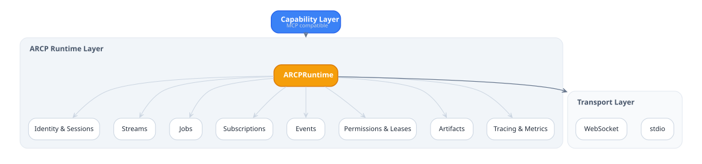

# `arcp/arcp` — ARCP PHP SDK

PHP 8.4 reference implementation of the [Agent Runtime Control Protocol
(ARCP) v1.0](RFC-0001-v2.md).

> **Status:** v0.1 complete. The Phase 0 plan is in [PLAN.md](PLAN.md);
> the conformance matrix is in [CONFORMANCE.md](CONFORMANCE.md).

## Quick start

```sh
composer install

# Tests
vendor/bin/phpunit --testdox

# Static analysis
vendor/bin/phpstan analyze
vendor/bin/psalm --no-cache

# Formatter
vendor/bin/php-cs-fixer fix --dry-run --diff

# Run a sample
php samples/02_tool_invoke_with_progress.php

# Run a runtime exposing a websocket port
bin/arcp serve --host 127.0.0.1 --port 8765
```

## Requirements

- PHP **8.4** or newer.
- Composer 2.x.
- The `pdo_sqlite`, `mbstring`, and `json` extensions (bundled with
  most PHP distributions).

## Architecture

<picture>
  <source media="(prefers-color-scheme: dark)" srcset="docs/diagrams/architecture-dark.svg">
  
</picture>

The runtime is `Arcp\Runtime\ARCPRuntime`; the client is
`Arcp\Client\ARCPClient`. Both are async (Amp v3 + fibers) and both take a
`Arcp\Transport\Transport` instance, which is one of `MemoryTransport`,
`WebSocketTransport`, or `StdioTransport`.

## Hello, ARCP

```php
use Arcp\Auth\AuthRouter;
use Arcp\Auth\NoneAuth;
use Arcp\Client\ARCPClient;
use Arcp\Messages\Session\Auth;
use Arcp\Messages\Session\Capabilities;
use Arcp\Messages\Session\PeerInfo;
use Arcp\Runtime\ARCPRuntime;
use Arcp\Runtime\JobContext;
use Arcp\Runtime\ToolHandler;
use Arcp\Transport\MemoryTransport;

$runtime = new ARCPRuntime(authRouter: new AuthRouter([new NoneAuth()]));
$runtime->registerTool('echo', new class implements ToolHandler {
    public function invoke(array $args, JobContext $ctx, ?\Amp\Cancellation $c = null): mixed
    {
        return ['echoed' => $args];
    }
});

[$serverT, $clientT] = MemoryTransport::pair();
$serverFuture = $runtime->serveAsync($serverT);

$client = new ARCPClient($clientT);
$client->open(
    Auth::none(),
    new PeerInfo('demo', '0.1'),
    new Capabilities(anonymous: true),
);
$result = $client->invokeTool('echo', ['ping' => 'pong']);
print_r($result->value);

$client->close();
$serverFuture->await();
```

## CLI

`bin/arcp` (registered in `composer.json`'s `bin`):

| Command | Purpose |
| --- | --- |
| `arcp serve --host H --port P` | Run a runtime accepting WebSocket connections. |
| `arcp tail ws://host:port/` | Subscribe and print every envelope. |
| `arcp send ws://… <tool> -a '{"k":"v"}'` | Invoke a tool and print the result. |
| `arcp replay events.sqlite -a msg_xyz` | Replay an event log file. |

## RFC mapping

| RFC section | Implementation |
| --- | --- |
| §6.1 Envelope | [src/Envelope/Envelope.php](src/Envelope/Envelope.php) |
| §6.2 Message types | [src/Messages/](src/Messages/) + [src/Envelope/MessageCatalog.php](src/Envelope/MessageCatalog.php) |
| §7 Capability negotiation | [src/Runtime/ARCPRuntime.php](src/Runtime/ARCPRuntime.php) |
| §8 Authentication | [src/Auth/](src/Auth/) |
| §10 Jobs | [src/Runtime/JobManager.php](src/Runtime/JobManager.php) + [JobContext](src/Runtime/JobContext.php) |
| §11 Streaming | `JobContext::openStream()` (text/event/log/thought; binary base64 only) |
| §12 Human-in-the-loop | [src/Client/Handlers/](src/Client/Handlers/) + `JobContext::requestHumanInput/Choice` |
| §13 Subscriptions | [src/Runtime/SubscriptionManager.php](src/Runtime/SubscriptionManager.php) |
| §15 Permissions & leases | [src/Runtime/LeaseManager.php](src/Runtime/LeaseManager.php) |
| §16 Artifacts | [src/Runtime/ArtifactStore.php](src/Runtime/ArtifactStore.php) |
| §17 Observability | [src/Messages/Telemetry/](src/Messages/Telemetry/) |
| §18 Errors | [src/Errors/](src/Errors/) |
| §19 Resume | [src/Store/EventLog.php](src/Store/EventLog.php) |
| §21 Extensions | [src/Extensions/](src/Extensions/) |
| §22 Transports | [src/Transport/](src/Transport/) |

## Samples

Six runnable scripts under [samples/](samples/), each backed by a
single sentence of context at the top. They all use `MemoryTransport`
to keep the example self-contained:

1. `01_minimal_session.php` — handshake.
2. `02_tool_invoke_with_progress.php` — tool + progress events.
3. `03_human_input_request.php` — HITL input.
4. `04_permission_challenge.php` — permission/lease.
5. `05_observer_subscription.php` — passive observer.
6. `06_relay_human_in_the_loop.php` — multi-channel HITL relay.

## Docs

Topic guides under [docs/](docs/):

- [docs/getting-started.md](docs/getting-started.md) — install and run
  an in-process client/runtime demo.
- [docs/architecture.md](docs/architecture.md) — PHP namespace layout
  and runtime/client layering.
- [docs/transports.md](docs/transports.md) — WebSocket, stdio, and
  in-memory transports.
- [docs/guides/auth.md](docs/guides/auth.md) — built-in schemes,
  AuthRouter wiring, custom schemes, failure semantics.
- [docs/guides/errors.md](docs/guides/errors.md) — full exception
  hierarchy, retry defaults, code-driven dispatch.
- [docs/guides/jobs.md](docs/guides/jobs.md) — tool invocation, job
  state, cancellation, budgets, and agent versions.
- [docs/guides/job-events.md](docs/guides/job-events.md) — progress,
  metrics, streams, subscriptions, and result chunks.
- [docs/recipes.md](docs/recipes.md) — PHP recipes for common flows.

## Supported PHP versions

PHP 8.4 and newer. Older minors are not supported.

## Changelog

See [CHANGELOG.md](CHANGELOG.md). Major-version migration notes live
in [UPGRADE.md](UPGRADE.md).

## What's not implemented in v0.1

See [PLAN.md §7](PLAN.md#7-out-of-scope-for-v01-explicit) for the full
list. Calls into out-of-scope surfaces throw `UnimplementedException`
with the relevant RFC section.

## License

Apache-2.0.
